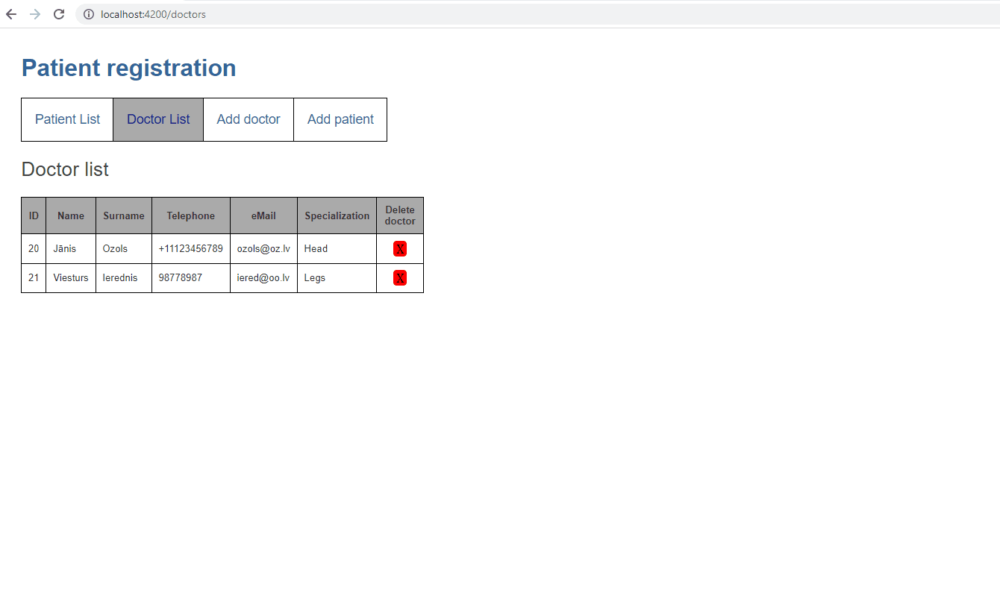
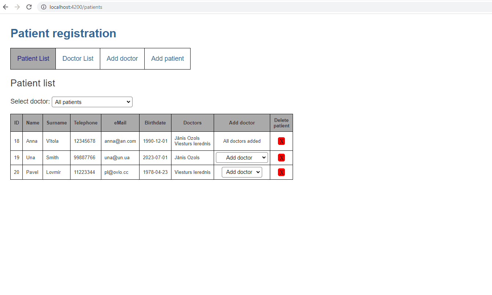

# PatientRegistration

Author: Edgars Berzins

## About

PatientRegistration system is a web application designed to facilitate the management of patients and doctors. It provides functionality to add, delete, view patients, add, delete, view doctors and assign patients to doctors.
The frontend of the application is developed using Angular, while the backend is implemented using ASP.NET. The local SQLite database is utilized to store the necessary data.

<p align="center">
  <b> Patient list page </b><br>
  
</p>

<p align="center">
  <b> Add patient page </b><br>
  
</p>

<p align="center">
  <b> Add doctor page </b><br>
  
</p>

## Installation and Setup Instructions

To run the project locally, follow the instructions below:

- Make sure you have Node.js and npm (Node Package Manager) installed on your machine.
- Clone the GitHub repository.
- SQLite database is already included in the repository. No additional setup is required.
- Install the Angular project dependencies.
- Start .NET Core API and Angular app.

The Angular app will run on http://localhost:4200, and it will send data to http://localhost:5252, where the .NET Core API is running.

Feel free to explore the project and make any necessary modifications to suit your specific environment and requirements.

## Additional Comments

For future development API controller includes additional methods:
- ```DeleteAllDoctors()``` - Deletes all doctors from the database.
- ```DeleteAllPatients()``` - Deletes all patients from the database.
- ```DeletePatient(PatientDto patientDto)``` - Deletes a patient from the database based on the specified patient object.
- ```AddPatientToDoctor(PatientDto patientDto, int doctorId)``` - Adds a patient to a doctor in the database.